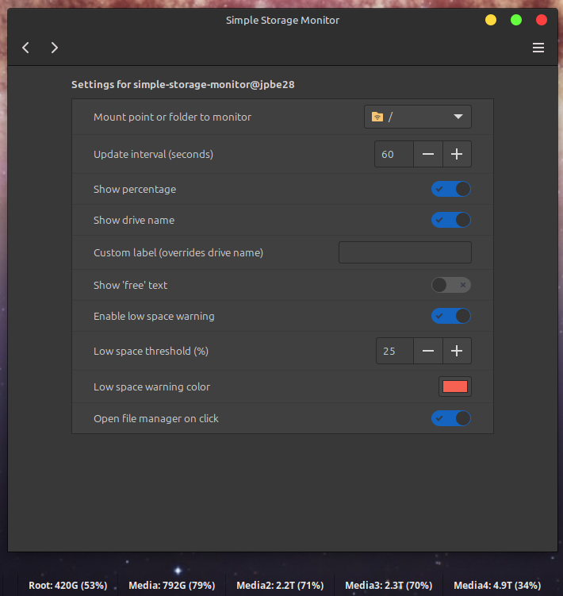

# Simple Storage Monitor Applet

A Cinnamon panel applet that displays the available space on a selected folder or mounted drive.



## Features

- Shows available disk space on a panel
- Displays usage percentage
- Click to open the folder/drive in file manager
- Detailed tooltip showing total, used, and available space
- Custom label support to override drive name
- Low space warning with customizable threshold and color
- Multiple instances supported
- Configurable display options

## Installation

### Method 1: Install from Cinnamon Spices (Easiest)

Install it directly from the Cinnamon applet menu:

1. Right-click on your Cinnamon panel
2. Select "Add applets to the panel"
3. Click on "Download" tab
4. Search for "Simple Storage Monitor"
5. Click "Install" next to the applet
6. The applet will be automatically installed and ready to use

### Method 2: Using the Installation Script

1. Run the installation script:
   ```bash
   cd /path/to/SimpleStorageMonitor
   chmod +x install.sh
   ./install.sh
   ```

### Method 3: Manual Installation

1. Copy the applet directory to your Cinnamon applets folder:
   ```bash
   cp -r /path/to/SimpleStorageMonitor ~/.local/share/cinnamon/applets/simple-storage-monitor@jpbe28
   ```

2. Reload Cinnamon:
   - Press `Alt+F2`, type `r`, and press Enter
   - Or restart Cinnamon from the system settings

3. Add the applet to your panel:
   - Right-click on the panel
   - Select "Applets"
   - Find "Simple Storage Monitor" and click "Add"

**Note:** For Methods 2 and 3, you'll need to download the applet files manually (from GitHub releases or by cloning the repository).

## Configuration

The applet includes a built-in settings UI. To configure it:

1. Right-click on the applet in the panel
2. Select "Configure..." or "Settings"
3. Adjust the settings as needed


## Requirements

Linux with Cinnamon desktop environment

Cinnamon 3.8 or later

Only tested with Linux Mint


## License

MIT License - See LICENSE file for details

## Author

JP Belanger(jpbe28)

